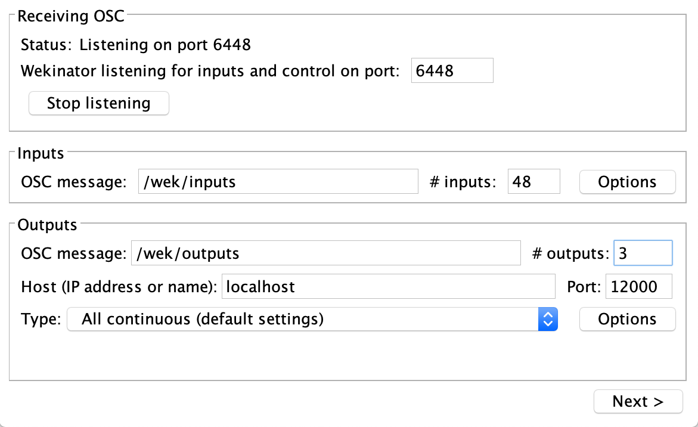

# Mouth-controlled FM synth 
 

## Steps:
1. Run Face-Landmarks model in RunwayML (requires docker).
2. Run `Processing_Face_Landmarks.pde` and `Processing_FM_Synth.pde` in Processing.
3. Open `face_landmarks_fm_synth.wekproj` in Wekinator. Wekinator listening port should be 6448.
4. Click on run.

## Wekinator config
If you want to create your own model, you will need the following configuration:
 

